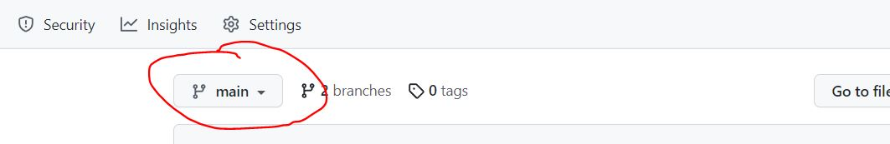

This is the web site for the Institute for AI in medicine at the University hospital Essen.
# Editors
> :warning: **Make sure you are on the `main`-branch**


> :warning: what you see in the online preview is likely not what you get

## Howto...
- [manage team members](#member)
- [manage publications](#publications)
- [add a project](#project)
- [add a new group](#new)
- [edit pages](#edit)


<h3 id="member">Manage Team members</h3>

Members of a group are defined in `<group-acronym>.yml` at [`/_data/people`](/_data/people).

Example entry:
```
- name: Hilde Muster
  mail: hilde.muster@example.org
  roles: ['shk']
  img: hilde-muster.png
```
#### Add Member
Add a new entry to the end of the file. See the example above or existing entries for proper format.  

Mandatory fields:
- name - first and last name
- title - e.g. Prof. Dr.
- mail - e-mail address
- roles - must be a list, even if it only has a single entry. The first entry **must** be the position in the group. Possible values:
  * shk - student assistant
  * phd - PhD candidate
  * postdoc - Researcher
  * admin - Administration
  * tech - Technical staff
  * head - group leader  
  Additional entries in the roles-list are optional, currently only `board` (for ikim board members) is supported

Optional fields:
- phone - phone nr, e.g. +4920112345
- position-special - more details for tech-staff, e.g. `HPC specialist`
- interests - a list of interests, e.g. `['machine learning', 'coffe']`
- img - first, upload an image to [`/img/people`](/img/people), then provide the filename here, e.g. `hilde-muster.jpg`
#### Remove Member
Simply delete the corresponding entry from the file
#### Modify Member
Edit the entry as needed


<h3 id="publications">Manage Publications</h3>

Replace `<group-acronym>.bib` at [`/_bibliography`](/_bibliography) with your latest bibtex list of publications relevant to ikim.

Make sure that exclusively either `doi` or `url` are set for an entry (not both). If both are available, `doi` is to prefer. You may use the export options of your favorite reference manager to remove the unnecessary one, e.g. [Zotero](https://www.zotero.org) with [Better Bibtex](https://retorque.re/zotero-better-bibtex/).

#### Author version pdf
Put the author version pdf at [`/pdf`](/pdf) and use the bibtex citation-key as filename (e.g. `nautaUncoveringCorrectingShortcut2022.pdf`). The pdf will then be available for download in the publication list.


<h3 id="project">Add project</h3>

Copy and edit an existing file at [`/projects/_posts`](/projects/_posts) or create a new one. 

The file name must be in the format `YYYY-MM-DD-name.md`. Use either the start date of the project or today's date, if the project starts in the future (future dates will not be displayed on the site). 

The file contents must start with the front matter:  

```
---
layout: project
title: "The project page title"
excerpt: Lorem ipsum dolor
tags: diair mml
---
```
Make sure to provide an `excerpt`, i.e., a short text snippet that will be displayed in the list of projects.  
Make sure to provide the group acronyms of involved groups in `tags`, in order for the project to be listed at the corresponding group pages.


<h3 id="edit">Edit pages</h3>

Pages mostly adhere to [markdown](https://github.com/adam-p/markdown-here/wiki/Markdown-Cheatsheet) syntax.
Group pages are located at [`/groups`](/groups), the page about the institute at [`/institute.md`](/institute.md), see above for [projects](#project). The remaining pages should not need to be edited (ask a dev if needed).

#### Images
Upload the image to [`/img`](/img). On the page you want to display the image, add:
```

```
Replace `file-name.png` with the name and ending of your uploaded image.


<h3 id="new">Add new group</h3>

- Add a new entry to [`/_data/groups.yml`](/_data/groups.yml). The name of the group (acronym) must be different from the existing ones. Let's use `xyz` as an example.
- Add bibtex list of publications (`xyz.bib`) to [`/_bibliography`](/_bibliography)
- Add `xyz.yml` to [`/_data/people`](/_data/people) (or copy and edit existing). Add members (cf. [Manage Team members](#member) above).
- Create group page `xyz.md` at [`/groups`](/groups) (or copy and edit existing). Make sure to set the group acronym in front matter:
```
---
layout: group
group: xyz
---
```

That's it.

# Devs
The site is built with [jekyll](https://jekyllrb.com), [scholar](https://github.com/inukshuk/jekyll-scholar)-plugin and [minima](https://github.com/jekyll/minima) theme.
## Run locally
1. Install [Ruby](https://www.ruby-lang.org)
2. Install [Bundler](https://bundler.io) `gem install bundler`
3. Checkout repo, install dependencies in the repo with `bundle install`
4. Run with `bundle exec jekyll serve`, the site is accessible at "http://127.0.0.1:4000/ikim-website/" (note the trailing `/`)

## Deployment
Github-pages does not support the scholar plugin. Hence, the site is first built via a github action at `/.github/workflows/build.yml` from the main branch. This action then pushes the ready-to-deploy build artefact to the gh-pages branch for deployment.

## Theme customization
`/assets/main.scss` loads the minima theme and customization in `/_sass/_ikim.scss`

## Todo
- [ ] Agree on citation key format
- [ ] Supplementary, Git repos, etc. in publication list
- [ ] Filter publication list by group acronym, by group leader may miss a few entries
- [ ] Clean filtering script